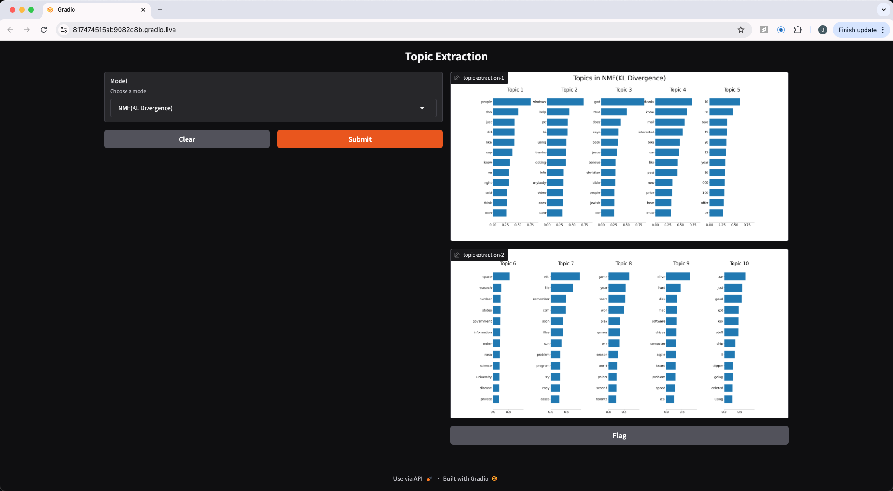

## Topic Extraction with Non-negative Matrix Factorization and Latent Dirichlet Allocation

### Overview
This project demonstrates the application of Non-negative Matrix Factorization (NMF) and Latent Dirichlet Allocation (LDA) on a corpus of documents to extract the underlying topic structures. The output is visualized as bar plots of topics, each represented by the top few words based on their weights.

A demo has been built using Gradio. Gradio provides an easy-to-use interface that allows users to input their documents and visualize the extracted topics.

[gradio-demo]()

    

### Methods
1. Non-negative Matrix Factorization (NMF)
NMF is applied with two different objective functions:
* Frobenius Norm: Minimizes the squared difference between the original and the reconstructed matrices.
* Generalized Kullback-Leibler (KL) Divergence: Also known as Probabilistic Latent Semantic Indexing, this minimizes the divergence between the original and the reconstructed matrices.

2. Latent Dirichlet Allocation (LDA)
LDA is a generative probabilistic model that explains the similarities between documents by associating them with topics.

